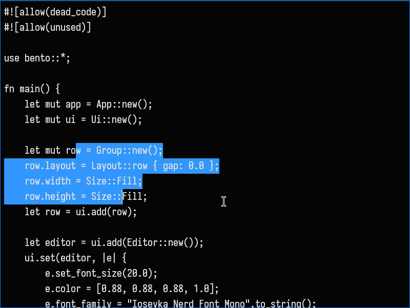
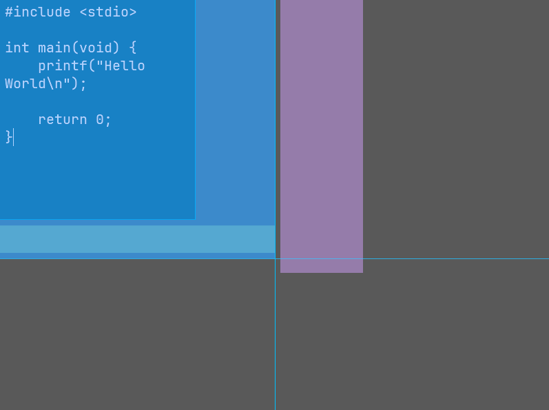
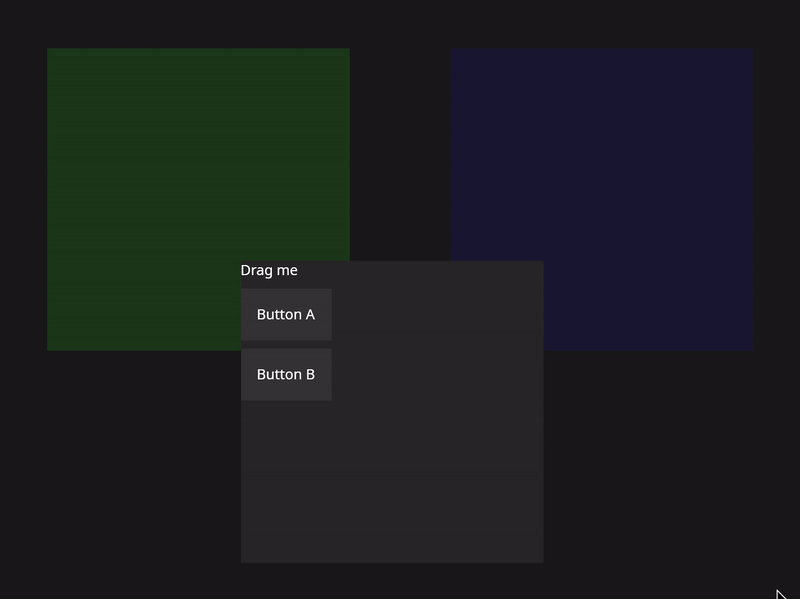

<h1 align="center">Bento</h1> 
<p align="center"><strong>Rust GUI framework</strong></p>

> Early development. API is unstable.

## Features
* Fast
* Cross-platform
* Extensible widget system
* Async support
* Custom layout engine

## Example

```rust
use bento::*;

fn main() {
    let mut app = App::new();
    let mut ui = Ui::new();

    let mut group = Group::new();
    group.layout = Layout::Row { gap: 8.0 };
    let group = ui.add(group);

    let btn = ui.add(Button::new("Click me"));
    ui.append(group, btn);

    app.open_window(WindowConfig::default(), ui);
    app.run();
}
```

## Screenshots



