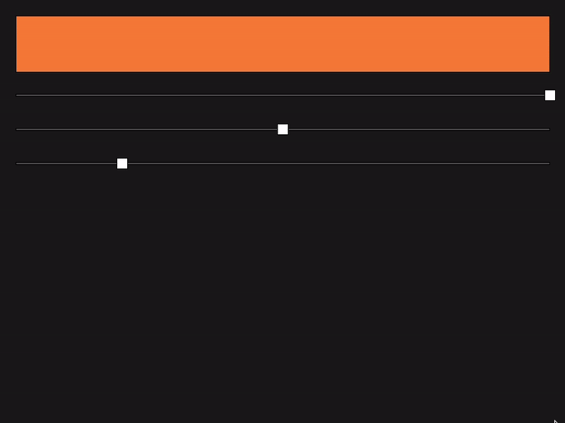

<h1 align="center">Bento</h1> 
<p align="center"><strong>Rust GUI framework</strong></p>

> Early development. API is unstable.

## Features
* Fast and simple to use
* Reactive model inspired by [`Svelte 5`](https://github.com/sveltejs/svelte) / [`SolidJS`](https://github.com/solidjs/solid)
* Cross-platform: Linux / macOS / Windows / Web
* Extensible component system
* Async support
* Custom [`wgpu`](https://github.com/gfx-rs/wgpu) renderer
* [`Taffy`](https://github.com/dioxusLabs/taffy) layout engine
  
| Svelte 5 | Bento |
|----------|-------|
| `.svelte component` | `#[component]` |
| `$state` | `state(value)` |
| `$derived` | `derived()` |
| `$effect` | `effect()` |
| `$inspect` | `inspect!(signal)` |
| `$bindable` | signals are `Copy`, just pass them directly |
| `$props` | just function arguments in Rust |
| `$host` | web component specific, not relevant |
| `bind:value` | `.bind(signal)` |
| `on:event` | `.on(\|e: &Event\| ...)` |
| `{#await}` | `await_(async { ... })` |
| `{#each}` | `each(signal, \|item\| ...)` |
| `{#if} / {:else} / {:else if}` | `.show(\|\| ...)` |
| `{#key}` | handled automatically by the retained tree |
| `#snippet` | just a function returning `impl View` |
| `transition:` | `.transition(Fade)` |
| `in:` | `.in_transition(FlyIn::y(200))` |
| `out:` | `.out_transition(Fade)` |

## Example

```rust
#[component]
fn sliders_demo() -> impl View {
    let r = state(1.0f32);
    let g = state(0.5f32);
    let b = state(0.2f32);

    group()
        .direction(col())
        .w(fill())
        .h(fill())
        .p(px(24.0))
        .gap(px(16.0))
        .child(
            rect(move || [r.get(), g.get(), b.get(), 1.0])
                .w(fill())
                .h(px(80.0)),
        )
        .child(slider(r, 0.0, 1.0))
        .child(slider(g, 0.0, 1.0))
        .child(slider(b, 0.0, 1.0))
}

#[main]
fn main() {
    App::run(sliders_demo());
}
```


