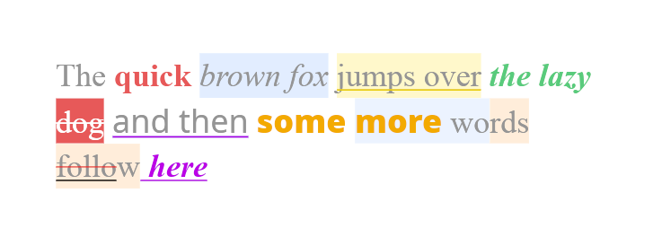

# bento_wgpu

2D GPU renderer built on [wgpu](https://github.com/gfx-rs/wgpu), designed as the rendering backend for [bento](https://github.com/oganas/bento).

Scene nodes can be added to a `Scene` and rendered with a `Renderer`.   

Multiwindow support using shared `RenderContext`.   

## Shape rendering
Only primitive for rendering shapes is `RectNode`

## Text rendering: 
`TextNode`   

Full unicode, emoji, and bidirectional support, relying on [cosmic-text](https://github.com/pop-os/cosmic-text).   

Customisable with per character ranges:
- Foreground color
- Background color
- Underline
- Strikethrough
- Weight
- Italic
- Font   

Text wrapping with `max_width`.   

Text alignment with `align`.   

Text letter spacing with `letter_spacing`.   

## Image rendering:
`ImageNode`   

## Performance
GPU uploads only on change.   
Glyph atlas with automatic repacking.   
Two layer cache separating redrawing and reshaping, depending on which properties changed.   
